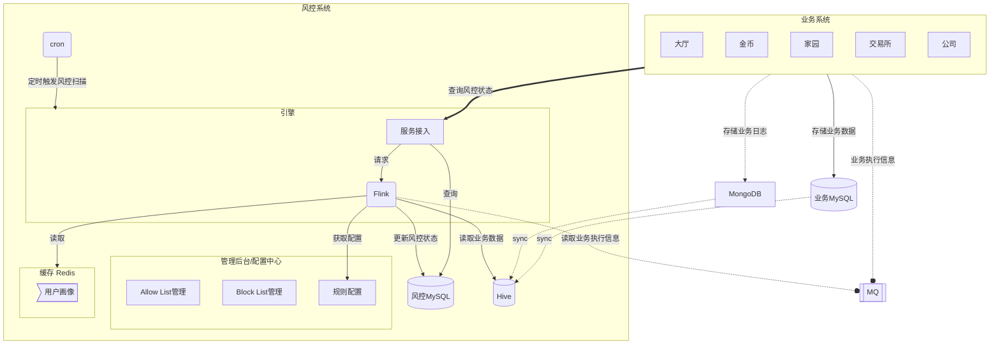
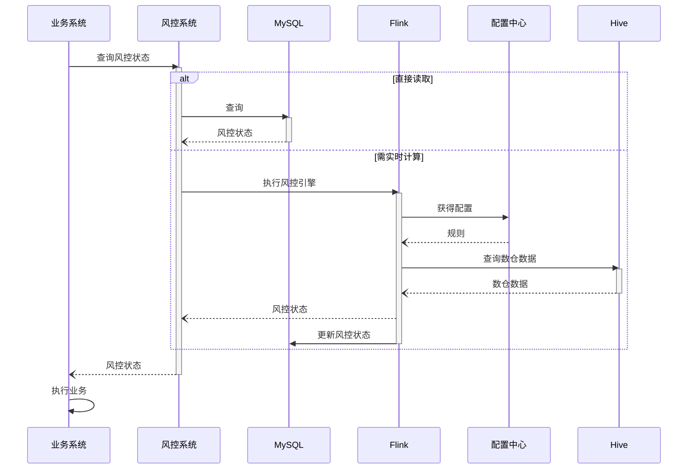
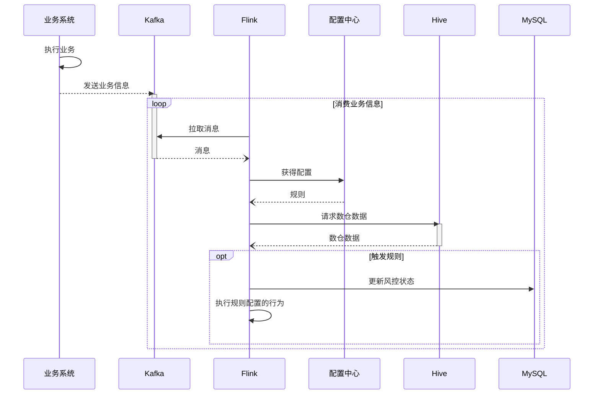
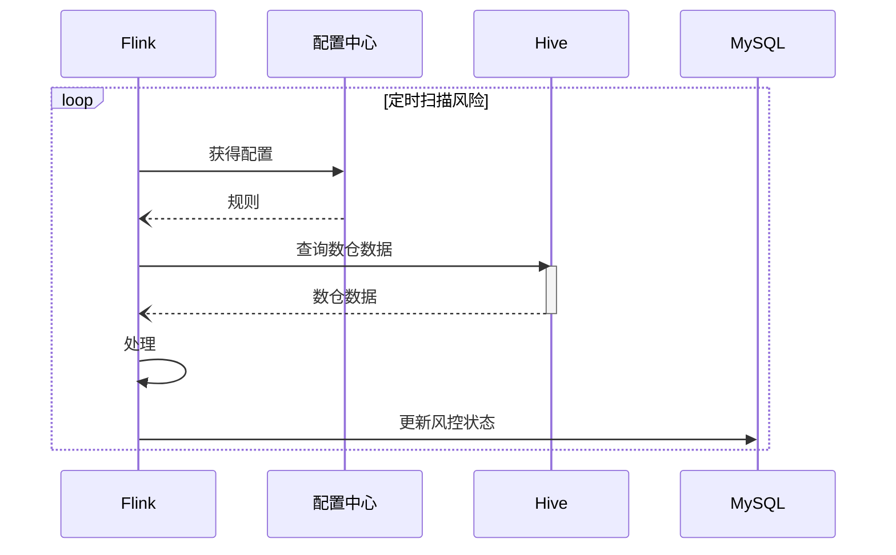

# 风控

### 考虑点

1. 性能。不能明显增加业务延迟
2. 时效性。实时引擎、异步(准实时)引擎、离线引擎
3. 稳定性。前置和后置等规则不影响业务稳定
4. 与业务耦合程度。尽量不增加业务开发人员的负担
5. 准确性。高效识别，减少误杀。目前规则人为制定，后续可能增强数据驱动，用机器学习技术智能对抗

### 技术方案

**架构设计**

1. 风控查询系统、风控管理系统分离
2. 规则配置，业务接入。暂时由开发手写逻辑
3. 为避免挤兑业务系统的数据库资源，风控系统尽量只从MQ或数据仓库中读取数据，而不直接读写业务数据库

**技术选型**

1. Spring Cloud 微服务提供 RPC 接口与业务服务交互。
2. Rabbit or Kafka：近实时引擎的中间层
3. Apache Flink 对MQ中的庞大原始数据进行处理。**抽取→转换→脱敏→归档**
4. Apache Hive：存储业务数据的数据仓库
5. Redis：缓存 allow list, block list, 用户画像等









### 伪代码

**业务代码**

```java
var riskInformation = riskControl.getRiskStatus(userId, otherData...);

if (riskInformation.atRisk()){
	// stop
}

// business logic
Record record = process();

// real-time
riskControl.detect(record);
// near-real-time
sendResult(mqChannel, record);
// offline
storeRecord(record);
```

**风控代码**

```java
// 获取风控状态
Data getRiskStatus(userId, otherData...){
	// 从 MongoDB or MySQL 等获得用户的风险状态
	return db.getStatus;
}

// real-time
// 从动态配置系统(如nacos)获取动态规则
Filters[] filters = configurationSystem.readFilters();
detect(record){
	Risk[] risks = {};
	// 从业务服务获取数据？直接从数据库读取
	var bizData = getBizData();
	for(Filter f: filters){
		if(f.detect(record, bizData)){
			risks.add(f.getRisk());
		}
	}
	if(!risks.empty()){
		// 更新用户风险状态
		updateRiskStatus(userId, bizId, risks);
		// 视情况和严重程度给用户、管理员、运营人员发送报警
		sendWarnings(risks, user, administor, operator...);
	}
}

// near-real-time
detectNearRealTime(){
	while(true){
		// 从 MQ 中读取业务数据
		record = myChannel.retrieve();
		detect(record);
	}
}
// offline
@Cron(hour=1)
detectHourly(){
	// 从数据仓库等处获取数据
	Data[] dataList = dataWarehouse.retrieveTodayData();
	for(Data record: dataList){
		detect(record);
	}
}
```

## 详细方案

**需求**

以下内容摘自《Quiz-Planet策划案 - 交易所》

> 对用户的一些数据设置报警阈值，不同的阈值对应不同的风险等级。系统会自动根据不同的情况进行处理。
> 
> 
> 
> | 风险等级 | 风险描述 | 处理方式 |
> | --- | --- | --- |
> | B1 | 用户出现异常行为 | 60s内无法进行物品和资金操作，如下单，上架下架物品等。用户收到风控警告邮件。 |
> | B2 | 用户账户出现资金或者物品危险 | 限制账号12H内无法进行任何资金交易，直到风险解除或者时间结束。用户会收到相关邮件，并且提供申诉渠道。系统对有危险的资金或者物品进行二次校验，如果校验结果正常，则取消限制。 |
> | B3 | 用户出现高危行为，需要立刻制止 | 用户被强制下线，且一定时间限制登陆*。用户会收到相关邮件，并且提供申诉渠道。 |
> | B4 | 用户出现严重违反规则的行为 | 用户被封禁，无法进入游戏。官方客服处理相关申诉。Demo中暂不实装。 |
> 
> 注：*限制登陆的时间采用累加制度，用户1年内被限制登陆行为会累加。
> 
> | 今年已经被限制登陆的次数 | 限制登陆时间 |
> | --- | --- |
> | 0 | 5分钟 |
> | 1 | 1小时 |
> | 2 | 12小时 |
> | 3 | 1天 |
> | 4 | 7天 |
> | 5 | 30天 |
> | 6 | 升级至B4等级，永久封禁 |
> 
> 用户风险参数表
> 
> | 编号 | 检测数值 | B1 | B2 | B3 |
> | --- | --- | --- | --- | --- |
> | 1 | 日交易金额 |  | 大于1亿 |  |
> | 2 | 月交易金额 |  | 大于10亿 |  |
> | 3 | 日交易次数 |  | 大于500 | 大于5000 |
> | 4 | 月交易次数 |  | 大于5000 | 大于50000 |
> | 5 | 1分钟内下单次数 | 大于5 | 大于20 | 大于30 |
> |  | 1分钟内上架与下架次数 | 大于10 | 大于50 |  |
> |  | 单日物品增加率（仅对当日0时账目物品数大于1000的用户才生效） | 大于200% | 大于1000% |  |
> |  | 单日资产增加率（仅对当日0时账目资金大于100w的用户才生效） |  | 大于200% |  |
> |  | 上架时物品来源校验 |  | 来源不明 |  |
> |  | 用户单日触发B1次数 |  | 大于3 |  |
> |  | 用户一周内触发B1次数 |  |  | 大于10 |
> |  | 用户单日A2风险订单数量 | 大于10 | 大于25 | 大于50 |
> |  | 用户单日A3风险订单数量 | 大于5 | 大于10 | 大于20 |
> 
> 注：目前未对用户账户进行分级，所有用户使用同一套标准。后续版本中可对用户进行精细化管理，不同的用户拥有不同的操作阈值。
> 

**方案**

每在交易所产生一笔订单，会像风控MQ中发送一条延迟消息（延迟太短无法保证DW已同步订单数据，太长则会导致MQ压力太大。根据DW同步速度和交易所内交易量调整），风控系统从MQ中获得消息，从DW中查询相关数据，并与配置的规则对比检查风险，并执行规则中配置的行为，根据风险等级表对用户相关的业务操作执行相应限制。

- 对于「日交易金额」，每获得一个用户的订单，就会读取该用户今日交易金额，并与规则配置的阈值进行比较，上例中参考「用户风险参数表」是1亿。月交易金额、日交易次数、月交易次数、1分钟内下单次数同理。
    
    ```mermaid
    sequenceDiagram
      participant biz as 交易所
    	participant MQ as Kafka
    	biz->>biz:执行业务
    	biz->>biz:延迟
    	biz-->>MQ:交易信息
    	activate MQ
    	loop 消费业务信息
    		Flink->>MQ:拉取消息
    		MQ--)Flink:交易信息
    		deactivate MQ
    		Flink->>配置中心:请求配置
    		activate 配置中心
    		配置中心--)Flink:规则和行为
    		deactivate 配置中心
    		Flink->>Hive:请求当日交易金额、当月交易金额、当日交易次数、当月交易次数、1分钟内下单次数
    		activate Hive
    		Hive--)Flink:当日交易金额、当月交易金额、当日交易次数、当月交易次数、1分钟内下单次数
    		deactivate Hive
    		opt 当日交易金额大于1亿||当月交易金额大于10亿
    			Flink->>MySQL:更新用户风控状态为B2
    		end
    		alt 当日交易次数大于5000
    			Flink->>MySQL:更新用户风控状态为B3
    		else 当日交易次数大于500
    			Flink->>MySQL:更新用户风控状态为B2
    		end
    		alt 当月交易次数大于50000
    			Flink->>MySQL:更新用户风控状态为B3
    		else 当月交易次数大于5000
    			Flink->>MySQL:更新用户风控状态为B2
    		end
    		alt 1分钟内下单次数大于30
    			Flink->>MySQL:更新用户风控状态为B3
    		else 1分钟内下单次数大于20
    			Flink->>MySQL:更新用户风控状态为B2
    		else 1分钟内下单次数大于5
    			Flink->>MySQL:更新用户风控状态为B1
    		end
    	end
    ```
    
- 对于「1分钟内上架与下架次数」由于时间跨度很小且上架和下架目前没有相应日志，可以在前端通过记录用户点击操作实现。
- 对于「单日物品增加率（仅对当日0时账目物品数大于1000的用户才生效）」每日0时存储一份账目物品数大于1000的用户ID组。在每日23:59分时，读取这份ID组，并对ID组中用户的物品进行清查，「单日资产增加率（仅对当日0时账目资金大于100w的用户才生效）」同理。
- 对于「用户单日触发B1次数」和「用户一周内触发B1次数」，可用上述存储在风控系统数据库中的风险数据来统计。每次用户触发B1，都会向MQ中发送一条消息记录这一状态，Flink消费到这条消息时，从db中统计近期B1次数，并与规则配置的阈值进行比较。「用户单日A2风险订单数量」、「用户单日A3风险订单数量」同理。
    
    ```mermaid
    sequenceDiagram
    	participant Flink
    	participant MQ
    	participant MySQL
    	participant cc as 配置中心
    	Flink->>MySQL:更新用户风控状态为B1
    	Flink-->>MQ:发送用户风控状态变更消息
    	loop 消费MQ消息
    		Flink->>MQ:拉取消息
    		MQ--)Flink:消息【用户风控状态变更为B1】
    		activate MySQL
    		Flink->>cc:请求配置
    		activate cc
    		cc--)Flink:规则和行为
    		Flink->>MySQL:统计用户当日B1次数
    		MySQL--)Flink:当日B1次数
    		Flink->>MySQL:统计一周内B1次数
    		MySQL--)Flink:一周内B1次数
    		alt 一周内触发B1次数大于10
    			Flink->>MySQL:更新用户风控状态为B3
    		else 当日触发B1次数大于3
    			Flink->>MySQL:更新用户风控状态为B2
    		end
    	end
    ```